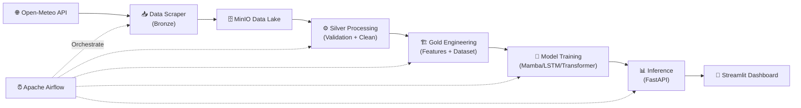

# 🎤 Kịch Bản Thuyết Trình 15 Phút — KLTN_Mamba

## Đề tài: Hệ thống Dự báo Chất lượng Không khí (AQI) Việt Nam sử dụng Mamba State Space Model

---

## 📋 Phân bổ thời gian tổng quan

| Phần | Thời lượng | Nội dung |
|------|-----------|----------|
| 1. Mở đầu & Bối cảnh | 2 phút | Vấn đề ô nhiễm, tại sao cần dự báo AQI |
| 2. Kiến trúc tổng thể | 2 phút | Data Lake + Pipeline + Model + Dashboard |
| 3. Data Pipeline (Bronze → Silver → Gold) | 3 phút | Quy trình thu thập & xử lý dữ liệu |
| 4. Mô hình Mamba & So sánh | 3.5 phút | Kiến trúc Mamba, LSTM, Transformer |
| 5. Training & Inference Pipeline | 2 phút | Tự động hóa với Airflow & FastAPI |
| 6. Demo Dashboard | 1.5 phút | Streamlit App |
| 7. Kết luận & Hướng phát triển | 1 phút | Đóng góp, hạn chế, hướng đi |

---

## 🔖 PHẦN 1: Mở đầu & Bối cảnh (2 phút)

### Slide 1: Trang bìa
- **Đề tài**: Hệ thống Dự báo Chất lượng Không khí Việt Nam sử dụng Mamba State Space Model
- Tên, MSSV, GVHD

### Slide 2: Vấn đề thực tế

> **Lời nói**: "Ô nhiễm không khí là một trong những vấn đề môi trường nghiêm trọng nhất tại Việt Nam. Chỉ số AQI (Air Quality Index) là thước đo quan trọng để đánh giá chất lượng không khí, ảnh hưởng trực tiếp đến sức khỏe cộng đồng. Tuy nhiên, các hệ thống dự báo AQI hiện tại ở Việt Nam còn hạn chế, đặc biệt là ở quy mô toàn quốc và khả năng dự báo theo thời gian thực."

**Điểm nhấn trên slide**:
- Việt Nam có nhiều đô thị với AQI thường xuyên vượt ngưỡng 100+ (Unhealthy)
- Nhu cầu dự báo AQI theo giờ cho **34 tỉnh/thành** trên toàn quốc
- Giúp người dân và cơ quan quản lý ra quyết định kịp thời

### Slide 3: Mục tiêu đề tài

> **Lời nói**: "Đề tài này xây dựng một hệ thống end-to-end từ thu thập dữ liệu, xử lý, huấn luyện mô hình đến hiển thị kết quả dự báo. Điểm đặc biệt là sử dụng kiến trúc Mamba — một State Space Model mới, hiệu quả hơn Transformer cho dữ liệu chuỗi thời gian dài."

- ✅ Thu thập dữ liệu AQI từ 34 tỉnh/thành theo giờ (Open-Meteo API)
- ✅ Xây dựng Data Lake theo kiến trúc Medallion (Bronze → Silver → Gold)
- ✅ Huấn luyện và so sánh 3 mô hình Deep Learning: **Mamba, LSTM, Transformer**
- ✅ Tự động hóa pipeline với Apache Airflow + Docker
- ✅ Dashboard trực quan với Streamlit

---

## 🔖 PHẦN 2: Kiến trúc Tổng thể (2 phút)

### Slide 4: Sơ đồ kiến trúc hệ thống

> **Lời nói**: "Hệ thống được thiết kế theo kiến trúc microservices, tất cả chạy trong Docker containers, bao gồm 6 thành phần chính."



**Điểm nhấn kỹ thuật cần nói**:
- **Nguồn dữ liệu**: Open-Meteo Air Quality API — 11 chỉ số khí tượng (PM2.5, PM10, NO₂, O₃, SO₂, CO, AOD, Dust, UV Index, CO₂, AQI)
- **Lưu trữ**: MinIO (S3-compatible) — 4 buckets: `air-quality`, `air-quality-silver`, `air-quality-gold`, `air-quality-artifacts`
- **Orchestration**: Apache Airflow với CeleryExecutor (2 DAGs: hourly + daily training)
- **Infrastructure**: Docker Compose — 10+ containers (PostgreSQL, Redis, MinIO, Airflow, ts-mamba, Streamlit)

### Slide 5: Tech Stack

| Layer | Công nghệ |
|-------|-----------|
| Data Source | Open-Meteo Air Quality API |
| Data Lake | MinIO (S3-compatible), Medallion Architecture |
| Processing | Python, Pandas, Scikit-learn |
| Deep Learning | PyTorch, Mamba-SSM, LSTM, Transformer |
| Experiment Tracking | MLflow |
| Orchestration | Apache Airflow 3.0 (CeleryExecutor) |
| Serving | FastAPI (container `ts-mamba`) |
| Visualization | Streamlit, Plotly |
| Infrastructure | Docker, Docker Compose |

---

## 🔖 PHẦN 3: Data Pipeline — Bronze → Silver → Gold (3 phút)

### Slide 6: Bronze Layer — Thu thập dữ liệu

> **Lời nói**: "Tầng Bronze chịu trách nhiệm thu thập dữ liệu thô từ Open-Meteo API cho 34 tỉnh/thành phố trên toàn quốc. Dữ liệu được lưu trữ theo cấu trúc partition: `province/year/month/day`."

**Chi tiết kỹ thuật** (file [data_scraper.py](file:///home/manno/KLTN_Mamba/DataSet/data_scraper.py)):
- Thu thập 11 chỉ số theo giờ từ Open-Meteo Air Quality API
- 2 chế độ: **Backfill** (lịch sử) và **Incremental** (cập nhật theo giờ)
- **Gap Detection thông minh**: Phát hiện 2 loại gap:
  - Ngày hoàn toàn thiếu (missing dates) → fetch toàn bộ ngày
  - Ngày có file nhưng thiếu giờ cuối (partial dates) → chỉ fetch giờ thiếu
- Retry logic với exponential backoff (Rate Limit 429)
- MinIO path: `air_quality/province={key}/year={Y}/month={MM}/day={DD}/data.csv`

**34 tỉnh/thành bao phủ**: Từ Hà Nội, HCM, Đà Nẵng... đến Cà Mau, An Giang (trải dài 3 miền)

### Slide 7: Silver Layer — Validation & Cleaning

> **Lời nói**: "Silver Layer có 2 module chạy tuần tự: Validation rồi đến Processing. Validation chia thành 2 mode: Hourly kiểm tra batch vừa cào, Daily kiểm tra tính đầy đủ cả ngày."

**Data Validation** ([Data_Validation.py](file:///home/manno/KLTN_Mamba/src/Silver/Data_Validation.py)):

| Mode | Rule | Kiểm tra |
|------|------|----------|
| Hourly | R1 Schema | Đủ 15 cột bắt buộc |
| Hourly | R2 Duplicate | Không trùng `(time, location)` |
| Hourly | R4 AQI Range | 0 ≤ AQI ≤ 500 |
| Hourly | R5 Physical Bounds | Giới hạn vật lý cho 11 chỉ số |
| Daily | R3 Continuity | Không có gap > 1.5h |
| Daily | R6 Missing Rate | Mỗi cột < 30% null |
| Daily | R7 Coverage | ≥ 90% giờ trong ngày (≥ 21/24h) |

- Validation rules có thể **load động** từ EDA output trên MinIO
- Xuất báo cáo validation JSON để audit

**Silver Processing** ([silver_processing.py](file:///home/manno/KLTN_Mamba/src/Silver/silver_processing.py)):
1. **Dedup**: Loại bỏ trùng lặp `(time, location)`, keep last
2. **Clip**: Clip giá trị về physical bounds (không xóa row)
3. **Impute**: Reindex hourly → Interpolate (gap ≤ 3h) → Forward-fill (gap ≤ 6h)
4. **Flag**: Gắn `_imputed`, `_invalid_segment` cho gap > 6h
5. **Reorder**: Sắp xếp cột chuẩn: identity → metrics → flags

### Slide 8: Gold Layer — Feature Engineering & Dataset

> **Lời nói**: "Gold Layer tạo features phục vụ model và build training dataset với quality gate nghiêm ngặt."

**Feature Engineering** ([gold_feature_engineering.py](file:///home/manno/KLTN_Mamba/src/Gold/gold_feature_engineering.py)):
- Cyclic time features: `hour_sin/cos`, `month_sin/cos` (Mamba không có positional encoding)
- Calendar: `day_of_week`, `is_weekend`
- Giữ nguyên audit flags từ Silver

**Training Dataset** ([prepare_training_dataset.py](file:///home/manno/KLTN_Mamba/src/Gold/prepare_training_dataset.py)):
- Sliding window: **seq_len=144** (6 ngày) → **pred_len=12** (12 giờ tới)
- **Quality Gate per-window**: Loại bỏ window chứa `_invalid_segment`, quá nhiều `_imputed`, hoặc `_flag_low_coverage`
- Temporal split: Train 70% / Val 10% / Test 20% (theo thời gian, KHÔNG random)
- StandardScaler fit on train, transform all
- Output: `.npy` arrays + `scaler.pkl` + metadata → lưu MinIO

---

## 🔖 PHẦN 4: Mô hình Mamba & So sánh (3.5 phút)

### Slide 9: Tại sao chọn Mamba?

> **Lời nói**: "Mamba là kiến trúc State Space Model được giới thiệu năm 2023 bởi Albert Gu và Tri Dao. Khác với Transformer có attention complexity O(n²), Mamba xử lý sequence với complexity O(n) — linear. Điều này đặc biệt quan trọng khi window size lớn 144 timesteps."

- **Vấn đề của Transformer**: Self-attention O(L²) — chậm khi sequence dài
- **Vấn đề của LSTM**: Khó giữ long-range dependencies, training tuần tự chậm
- **Giải pháp Mamba**: Selective State Space Model
  - Complexity O(L) — linear theo sequence length
  - **Selective mechanism**: Chọn lọc thông tin quan trọng (như attention nhưng hiệu quả hơn)
  - Hardware-aware implementation (fused CUDA kernels)

### Slide 10: Kiến trúc Mamba Model

> **Lời nói**: "Model Mamba trong đề tài là `TimeSeriesMambaRegressor` — một pure time-series regressor, không sử dụng location embedding."

```
Input (batch, 144, 17)
    ↓
Linear Projection → (batch, 144, d_model=128)
    ↓
Mamba Block × 3 layers
  ├─ SSM (d_state=16, d_conv=4, expand=2)
  ├─ Selective Scan (linear recurrence)
  └─ Dropout (0.1)
    ↓
LayerNorm
    ↓
Take last timestep → (batch, 128)
    ↓
MLP Head: Linear → GELU → Dropout → Linear
    ↓
Output (batch, 12)  ← Dự báo 12 giờ tới
```

**Hyperparameters chính** (từ [air_quality.yaml](file:///home/manno/KLTN_Mamba/Conf/air_quality.yaml)):
- `d_model`: 128, `n_layers`: 3, `d_state`: 16, `d_conv`: 4, `expand`: 2
- `epochs`: 150, `batch_size`: 32, `lr`: 0.0002
- Loss: Huber Loss (δ=1.0) — robust hơn MSE với outliers
- Optimizer: AdamW (weight_decay=0.0003)
- Scheduler: CosineAnnealingLR (min_lr=1e-5)
- Early Stopping: patience=20

### Slide 11: So sánh 3 kiến trúc

> **Lời nói**: "Đề tài triển khai 3 model với cùng interface `forward(x_seq) → y_pred`, giúp so sánh công bằng trên cùng dữ liệu."

| Đặc điểm | **Mamba** | **LSTM** | **Transformer** |
|-----------|-----------|----------|-----------------|
| Kiến trúc | SSM (Selective Scan) | LSTM + Temporal Attention | Encoder-only + Positional Encoding |
| Complexity | **O(L)** linear | O(L) sequential | O(L²) quadratic |
| `d_model` | 128 | 128 (hidden_size) | 96 |
| Layers | 3 | 2 | 2 |
| Đặc biệt | Selective mechanism | Attention pooling (query=last timestep) | Multi-head attention (4 heads) |
| Long-range | ✅ Tốt (state space) | ⚠️ Hạn chế | ✅ Tốt nhưng tốn bộ nhớ |

**LSTM đáng chú ý** ([lstm_model.py](file:///home/manno/KLTN_Mamba/src/Model/LSTM/lstm_model.py)):
- Có **Temporal Attention** layer (không phải vanilla LSTM)
- Query = last timestep, Key/Value = toàn bộ LSTM output
- Sinusoidal positional encoding giống Transformer

**Transformer** ([transformer_model.py](file:///home/manno/KLTN_Mamba/src/Model/Transformer/transformer_model.py)):
- Encoder-only (không có decoder)
- Pre-norm architecture (norm_first=True)
- GELU activation

### Slide 12: Training Pipeline & Metrics

> **Lời nói**: "Training pipeline được chia sẻ chung cho cả 3 model thông qua `train_sequence_aqi.py`, đảm bảo công bằng trong so sánh."

**Training features** (từ [train_sequence_aqi.py](file:///home/manno/KLTN_Mamba/src/Model/Common/train_sequence_aqi.py)):
- **Mixed Precision (AMP)**: Tăng tốc trên GPU
- **Gradient Accumulation**: Hỗ trợ batch size lớn hơn trên GPU nhỏ
- **Gradient Clipping**: Ổn định training
- **Early Stopping**: Tránh overfitting
- **Persistence Baseline**: So sánh với naive forecast (AQI giờ trước = AQI giờ sau)
- **MLflow tracking**: Log metrics, params, artifacts

**Metrics đánh giá**:
- MAE (Mean Absolute Error) — trên scale gốc (AQI units)
- RMSE (Root Mean Squared Error)
- R² Score
- Huber Loss (val/test)

---

## 🔖 PHẦN 5: Tự động hóa với Airflow & FastAPI (2 phút)

### Slide 13: Airflow DAGs

> **Lời nói**: "Hệ thống có 2 DAGs chính trong Airflow, tự động hóa toàn bộ pipeline từ thu thập đến dự báo."

**DAG 1: `air_quality_hourly`** — Chạy mỗi giờ ([air_quality_hourly.py](file:///home/manno/KLTN_Mamba/Airflow/dags/air_quality_hourly.py))
```
Ingest Incremental → Validate Hourly → Process Silver → Build Gold Features
    → [Per Province] Prepare Inference Input → Call Mamba API /inference
```
- Xử lý song song per-province ở phase inference
- Gọi Mamba API thông qua HttpOperator

**DAG 2: `air_quality_manual_training`** — Chạy thủ công ([air_quality_daily_training.py](file:///home/manno/KLTN_Mamba/Airflow/dags/air_quality_daily_training.py))
```
Validate Daily Range → Reprocess Silver → Rebuild Gold Features
    → [Per Province] Prepare Training Dataset → Call Mamba API /train
```
- Train riêng model cho từng tỉnh/thành
- Timeout lên đến 6 giờ per-province training

### Slide 14: FastAPI Serving (ts-mamba container)

> **Lời nói**: "Model được phục vụ qua FastAPI trong container Docker riêng tên `ts-mamba`, cung cấp 2 endpoint chính."

**Endpoints** (từ [api.py](file:///home/manno/KLTN_Mamba/api.py)):
- `GET /health` — Health check
- `POST /train` — Nhận `run_id`, `model_type` (mamba/lstm/transformer) → trigger training
- `POST /inference` — Nhận `inference_run_id`, `model_run_id` → trả về predictions

**Luồng hoạt động**:
1. Airflow gọi `/train` → subprocess chạy training script → save model lên MinIO
2. Airflow gọi `/inference` → load model (local hoặc từ MinIO) → predict → save results lên MinIO
3. Streamlit đọc results từ MinIO → hiển thị dashboard

---

## 🔖 PHẦN 6: Demo Dashboard (1.5 phút)

### Slide 15: Streamlit Dashboard

> **Lời nói**: "Dashboard Streamlit cung cấp 4 tab chính, giúp người dùng theo dõi AQI theo thời gian thực và dự báo."

**4 Tab chính** (từ [streamlit_app.py](file:///home/manno/KLTN_Mamba/App/streamlit_app.py)):

1. **🟢 AQI hiện tại**: Hiển thị AQI gần nhất từ dữ liệu đã cào (Bronze)
   - Card: AQI hiện tại, thời điểm, trung bình, số tỉnh vượt ngưỡng 100
   - Bảng & danh sách khu vực cần lưu ý

2. **📊 Tổng Quan Dự Đoán**: Tổng hợp forecast cho tất cả tỉnh/thành
   - Chart: Xu hướng AQI các điểm nóng (top 6 tỉnh)
   - AQI bands background (Good → Hazardous)
   - Bảng: AQI gần nhất, trung bình, cao nhất per-province

3. **🔍 Chi tiết tỉnh/thành**: Forecast chi tiết cho 1 tỉnh được chọn
   - Status card (dự báo gần nhất, đỉnh AQI, trung bình)
   - Line chart với markers theo level AQI
   - Timeline chi tiết từng mốc giờ

4. **📅 AQI quá khứ**: Dữ liệu AQI đã ghi nhận trong 24h qua
   - So sánh với hiện tại

**Design highlights**:
- 6 mức AQI với color coding: Good (xanh) → Hazardous (đỏ đậm)
- Lời khuyên sức khỏe cho mỗi mức AQI
- Responsive layout, glassmorphism effects

> **[Demo trực tiếp]**: Mở `http://localhost:8501`, chọn tab "Tổng Quan Dự Đoán", highlight chart & risk list

---

## 🔖 PHẦN 7: Kết luận & Hướng phát triển (1 phút)

### Slide 16: Đóng góp chính

> **Lời nói**: "Đề tài đã hoàn thành đầy đủ một hệ thống end-to-end cho dự báo AQI."

- ✅ **End-to-end pipeline**: Từ data collection → model training → serving → visualization
- ✅ **Medallion Architecture**: Data Lake chuẩn (Bronze → Silver → Gold) với quality gates
- ✅ **Mamba for Time Series**: Ứng dụng kiến trúc SSM mới cho forecasting
- ✅ **So sánh công bằng**: 3 kiến trúc DL trên cùng data & metrics
- ✅ **Production-ready**: Docker, Airflow, FastAPI, MLflow
- ✅ **Quy mô toàn quốc**: 34 tỉnh/thành, 11 chỉ số, dữ liệu theo giờ

### Slide 17: Hạn chế & Hướng phát triển

**Hạn chế**:
- Phụ thuộc Open-Meteo API (free tier, rate limited)
- Chưa tích hợp dữ liệu vệ tinh, thời tiết
- Chưa có notification/alert system

**Hướng phát triển**:
- Tích hợp thêm nguồn dữ liệu (WAQI, trạm quan trắc thực)
- Multi-modal: kết hợp ảnh vệ tinh + thời tiết + traffic
- Deploy lên cloud (AWS/GCP) với auto-scaling
- Mobile app notification khi AQI vượt ngưỡng

### Slide 18: Q&A

---

## 🛡️ Chuẩn bị câu hỏi phản biện

### ❓ Về Mamba vs Transformer

**Q**: "Tại sao Mamba tốt hơn Transformer cho bài toán này?"

**A**: "Mamba có complexity O(L) linear so với O(L²) của Transformer. Với window size 144 timesteps (6 ngày dữ liệu hourly), Mamba nhanh hơn đáng kể. Ngoài ra, selective mechanism của Mamba cho phép model tự chọn lọc thông tin quan trọng theo context, tương tự attention nhưng hiệu quả hơn. Tuy nhiên, với dữ liệu chúng em đang dùng, cả 3 model cho kết quả khá tương đồng — điểm mạnh chính của Mamba là ở tốc độ training/inference."

### ❓ Về Data Quality

**Q**: "Làm sao đảm bảo chất lượng dữ liệu đầu vào?"

**A**: "Hệ thống có 3 tầng quality gate:
1. **Hourly Validation**: 4 rules kiểm tra schema, duplicate, AQI range, physical bounds ngay khi cào
2. **Daily Validation**: 3 rules kiểm tra continuity, missing rate, coverage sau khi đủ ngày
3. **Window Quality Gate**: Khi tạo training samples, mỗi sliding window được kiểm tra _invalid_segment, _imputed ratio (< 30%), _flag_low_coverage — chỉ window sạch mới được đưa vào training"

### ❓ Về việc sử dụng Open-Meteo

**Q**: "Tại sao dùng Open-Meteo thay vì trạm quan trắc thực?"

**A**: "Open-Meteo cung cấp dữ liệu dựa trên model khí tượng (CAMS, Copernicus), bao phủ toàn cầu và miễn phí. Ưu điểm là có đủ 11 chỉ số cho mọi tọa độ, không phụ thuộc vào trạm quan trắc vật lý (Việt Nam có rất ít trạm). Hạn chế là accuracy có thể thấp hơn trạm thực. Trong hướng phát triển, chúng em đề xuất fusion data từ cả 2 nguồn."

### ❓ Về Airflow & Docker

**Q**: "Tại sao cần Docker + Airflow thay vì cron job đơn giản?"

**A**: "Docker đảm bảo reproducibility — môi trường giống hệt nhau mọi lúc. Airflow cung cấp: dependency management giữa các task, retry logic, monitoring UI, scheduling linh hoạt, và đặc biệt là xử lý per-province parallel training. Hệ thống có 10+ containers phối hợp — quản lý bằng cron job sẽ rất phức tạp."

### ❓ Về Temporal Features

**Q**: "Tại sao cần thêm `hour_sin/cos` thay vì dùng hour trực tiếp?"

**A**: "Mamba (và LSTM) không có positional encoding như Transformer. Cyclic encoding `sin/cos` đảm bảo: (1) hour 23 gần hour 0 về mặt toán học (tính tuần hoàn), (2) giá trị luôn trong [-1, 1] không cần normalize thêm. EDA cho thấy AQI có daily peak lúc 11-12h và monthly peak tháng 4 — cyclic features giúp model học được pattern này."

### ❓ Về Early Stopping & Overfitting

**Q**: "Làm sao tránh overfitting khi train 150 epochs?"

**A**: "5 cơ chế: (1) Early stopping patience=20 — dừng nếu val_loss không cải thiện 20 epoch liên tiếp. (2) Dropout=0.1 trong model. (3) Weight decay=0.0003 (L2 regularization). (4) CosineAnnealingLR giảm learning rate dần. (5) Huber Loss ít bị ảnh hưởng bởi outliers hơn MSE."

### ❓ Về Scaling Strategy

**Q**: "Tại sao dùng StandardScaler fit on train only?"

**A**: "Để tránh data leakage — nếu fit scaler trên toàn bộ data (bao gồm test), model gián tiếp 'nhìn thấy' thông tin từ tương lai. EDA cho thấy skewness=0.71 ≈ 0 nên StandardScaler đủ tốt (không cần RobustScaler). Config cho phép chuyển sang robust hoặc minmax nếu cần."

---

## 💡 Mẹo trình bày

1. **Mở đầu**: Bắt đầu bằng con số cụ thể (VD: "34 tỉnh, 11 chỉ số, dữ liệu theo giờ")
2. **Data Pipeline**: Dùng sơ đồ luồng, highlight quality gates
3. **Model**: Tập trung vào **tại sao** chọn Mamba, không cần giải thích toán chi tiết SSM
4. **Demo**: Chuẩn bị sẵn data, mở dashboard trước khi demo
5. **Kết thúc**: Nhấn mạnh "production-ready" — không chỉ là prototype

> [!TIP]
> Nếu thời gian thiếu, có thể rút gọn Phần 5 (Airflow) bằng cách chỉ show slide sơ đồ DAG mà không đi sâu vào chi tiết.

> [!IMPORTANT]
> Nhớ chạy `docker compose up -d` trước buổi thuyết trình ít nhất 5 phút để các container sẵn sàng cho demo.
